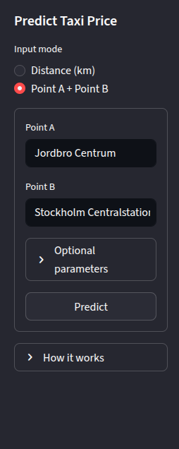
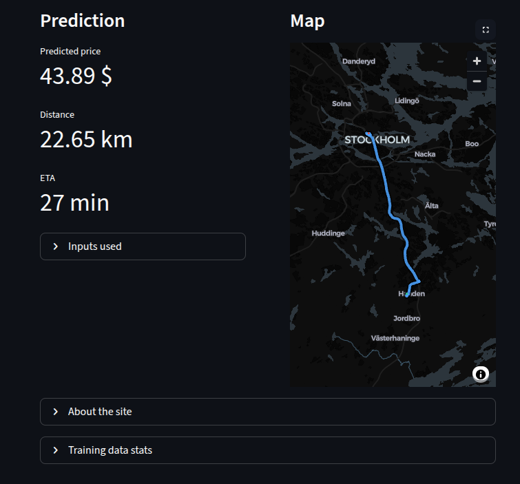
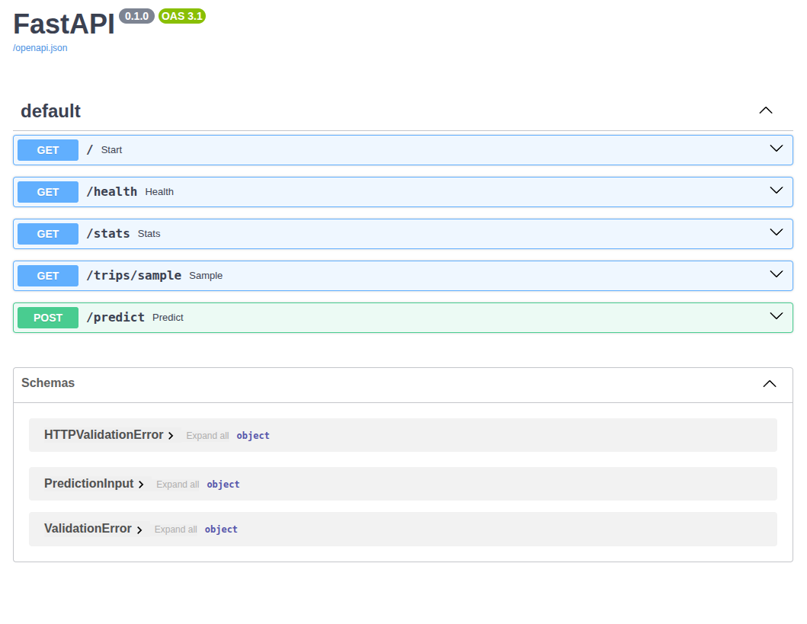
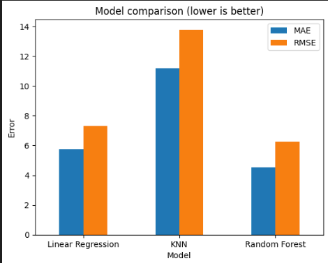
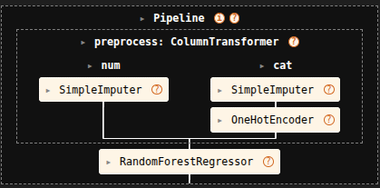

# Taxi Price Prediction

<p align=center>



</p>

---

## Purpose and Goals

This project demonstrates an end-to-end machine learning workflow for predicting taxi prices based on structured trip data.
It is designed as an educational project, with emphasis on correctness, reproducibility, and clean software structure rather than maximum predictive performance.

The project focuses on:
- building a reproducible ML pipeline
- avoiding data leakage
- separating data processing, modeling, API, and frontend concerns
- exposing predictions via an API and a simple frontend
- applying realistic MLOps-oriented project structure

---

## Project Structure
```
.
├── assets/                 # Documentation images & screenshots
├── data/
│   ├── raw/                # Immutable source data
│   └── processed/          # Cleaned training data
├── models/                 # Trained model
├── notebooks/              # EDA & experimentation
├── src/
│   └── taxipred/
│       ├── backend/        # FastAPI services
│       │   ├── api.py
│       │   ├── services.py
│       │   └── schemas.py
│       ├── frontend/       # Streamlit app
│       │   ├── app.py
│       │   ├── ui.py
│       │   └── services.py
│       └── common/         # Shared utilities & constants
├── pyproject.toml
└── uv.lock
```

---

## How to Use This Repo

### 1. Install dependencies
This project uses pyproject.toml and uv.lock.

/
Using uv:
```bash
uv sync
uv pip install -e .
```
Or using pip:
```bash
pip install -e .
```
---

### 2. Run the API (FastAPI)
```bash
uv run uvicorn taxipred.backend.api:app --reload
```

Open Swagger UI: http://127.0.0.1:8000/docs
<p align="center">

</p>

---

### 3. Run the Frontend (Streamlit)
```bash
uv run streamlit run src/taxipred/frontend/app.py
```
---

### 4. Model Artifact
The trained model is stored at: `models/taxi_price_predictor.joblib`

It is loaded by the prediction logic during inference.

<p align=center>


</p>

---

## Notebooks Overview
- 01_eda.ipynb: Dataset exploration and sanity checks
- 02_data_cleaning.ipynb: Cleaning and exporting processed data
- 03_model_test_eval.ipynb: Model comparison and evaluation
- 04_creating_pipeline.ipynb: Building and serializing the final pipeline

---

## Insights

### Separation of concerns
- Notebooks are used for experimentation only.
- Production logic lives under src/.
- API, frontend, and model logic are decoupled.
- Frontend and backend logic are structured around SRP, with thin entrypoints and explicit service layers.


### Reproducibility
- Raw data remains immutable.
- Processed data and model artifacts are versioned.
- Dependency versions are pinned.

### ML best practices
- Preprocessing logic is shared between training and inference.
- Clear boundaries reduce risk of data leakage.

---

## Limitations & Design Notes

- Educational project; not production-ready.
- No monitoring or CI/CD included.
- Model retraining required if features change.

LLMs were used for documentation support, image generation, and routing implementation guidance.


---
<p>
<p align="center">


</p>
